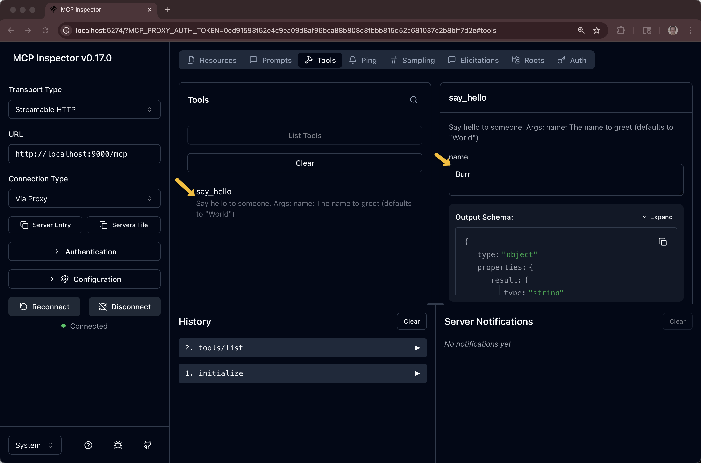

# MCP Server Tutorial


# Example 1: Simplest MCP Server

This is the most basic MCP (Model Context Protocol) server implementation. It demonstrates the fundamental structure of an MCP server with a single tool.

## What This Example Demonstrates

- Basic MCP server setup
- Registering a single tool (`echo`)
- Tool input schema definition
- Handling tool execution
- Using stdio transport for communication

## Files

- `server-stdio-echo.py` - The MCP server implementation using https://pypi.org/project/mcp/


## How It Works

The server exposes one tool:
- **echo**: Takes a message string and echoes it back

## Installation

1. Create a virtual environment:
```bash
python3 -m venv .venv
source .venv/bin/activate  # On Windows: venv\Scripts\activate
```

2. Install dependencies:
```bash
pip install -r requirements.txt
```

## Running the Server via stdio

The MCP server uses stdio (standard input/output) for communication, so it's designed to be run by an MCP client rather than directly:

```bash
python 01-simple-server/server-stdio-echo.py
```

However, running it directly will wait for input. It's meant to be used with a client (see Example 2) or an MCP host like Claude Desktop or Cline.  Or MCP inspector.

```bash
cntrl-c
```

## Testing with a MCP inspector

```bash
brew install mcp-inspector
```

```bash
mcp-inspector python 01-simple-server/server-stdio-echo.py
```


```bash
mcp-inspector python 01-simple-server/server-stdio-math.py
```


# Example 2: Simplest MCP Client

This is the most basic MCP (Model Context Protocol) client implementation. It demonstrates how to connect to an MCP server and interact with it.

## What This Example Demonstrates

- Connecting to an MCP server using stdio transport
- Initializing a client session
- Listing available tools from a server
- Calling tools with arguments
- Handling tool responses

## Prerequisites

You need the Example 1 server to run this client. Make sure the server is in the correct relative path (`../01-simple-server/server.py`).


## Running the Client

```bash
python 02-simple-client/client-stdio-echo.py
```

```bash
python 02-simple-client/client-stdio-math.py
```

```bash
python 02-simple-client/client-stdio-math-divide-by-zero.py
```


## Expected Output for Echo

```
Connected to MCP server!

=== Listing Available Tools ===

Tool: echo
Description: Echoes back the input text
Input Schema: {'type': 'object', 'properties': {...}, 'required': ['message']}

==================================================

=== Calling the 'echo' Tool ===
Result: Echo: Hello from the MCP client!

==================================================

=== Calling 'echo' Again ===
Result: Echo: MCP is working!
```


# Example 3: HTTP MCP servers with FastMCP


```bash
python 03-http-server-fastmcp/fastmcp-server-hello-world.py
```





```bash
python 03-http-server-fastmcp/fastmcp-server-math.py
```


# Example 4: Resources

**Resources** are read-only data sources:
- Represent data that can be retrieved
- Use URIs for identification
- Good for: configuration, documentation, data exports

**Tools** are executable functions:
- Perform actions or computations
- Can modify state
- Good for: operations, transformations, API calls

## Available Resources

### Static Resources
1. **note://static/welcome**
   - Plain text welcome message
   - Always returns the same content

2. **note://static/info**
   - JSON server information
   - Includes timestamp (changes each read)

### Dynamic Resources (Templates)
1. **note://notes/{id}**
   - Access notes by ID
   - Available IDs: `note1`, `note2`
   - Example: `note://notes/note1`

Run the example, the client invokes the server

```bash
python 04-server-with-resources/mcp-client-resources.py
```

```
==================================================
AVAILABLE RESOURCES
==================================================

  📄 Welcome Note
     URI: note://static/welcome
     Type: text/plain
     Description: A static welcome message

  📄 Server Info
     URI: note://static/info
     Type: application/json
     Description: Information about this MCP server

==================================================
RESOURCE TEMPLATES
==================================================

  📋 Note by ID
     URI Pattern: note://notes/{id}
     Type: text/plain
     Description: Access a specific note. Available IDs: note1, note2

==================================================
READING: note://static/welcome
==================================================
Welcome to the MCP Resource Server!

This server demonstrates static and dynamic resources.

==================================================
READING: note://static/info
==================================================
{
  "name": "Resource Demo Server",
  "version": "1.0.0",
  "capabilities": [
    "static_resources",
    "resource_templates"
  ],
  "timestamp": "2025-10-09T18:05:14.764054"
}

==================================================
READING: note://notes/note1
==================================================
Title: Meeting Notes
Created: 2024-01-15

Discussed project timeline and milestones

==================================================
READING: note://notes/note2
==================================================
Title: Ideas
Created: 2024-01-16

New features to implement in Q2

==================================================
ALL TESTS COMPLETED SUCCESSFULLY
==================================================
```

## Example 5: Resources & Tools

```bash
python 05-complete-server/mcp-client-resources-tools.py
```

## Example 6: 

skipping for now


## Example 7: weather API wrapper

```bash
mcp-inspector python 07-weather-api-server/server-stdio-weather-dot-gov.py
```


```bash
mcp-inspector python 07-weather-api-server/server-stdio-weather-open-meteo.py
```


### FastMCP Weather API wrapper

```bash
python 07-weather-api-server/server-fastmcp-weather-dot-gov.py
```

```bash
mcp-inspector
```


