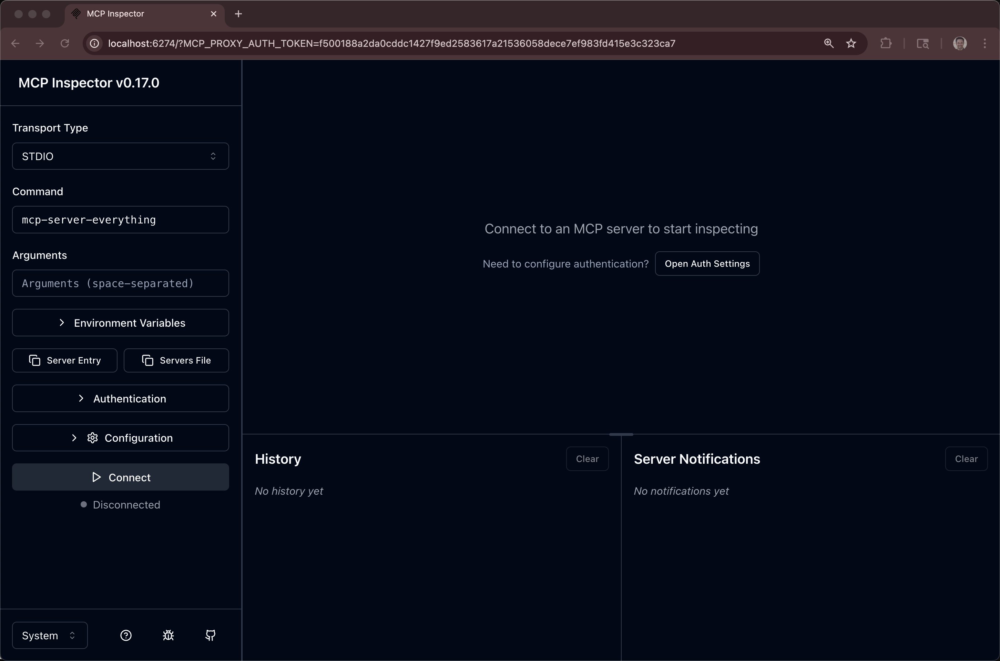

# MCP Server Tutorial


# Example 1: Simplest MCP Server

This is the most basic MCP (Model Context Protocol) server implementation. It demonstrates the fundamental structure of an MCP server with a single tool.

## What This Example Demonstrates

- Basic MCP server setup
- Registering a single tool (`echo`)
- Tool input schema definition
- Handling tool execution
- Using stdio transport for communication

## Files

- `server-stdio-echo.py` - The MCP server implementation using https://pypi.org/project/mcp/


## How It Works

The server exposes one tool:
- **echo**: Takes a message string and echoes it back

## Installation

1. Create a virtual environment:
```bash
python3 -m venv .venv
source .venv/bin/activate  # On Windows: venv\Scripts\activate
```

2. Install dependencies:
```bash
pip install -r requirements.txt
```

## Running the Server via stdio

The MCP server uses stdio (standard input/output) for communication, so it's designed to be run by an MCP client rather than directly:

```bash
python 01-simple-server/server-stdio-echo.py
```

However, running it directly will wait for input. It's meant to be used with a client (see Example 2) or an MCP host like Claude Desktop or Cline.  Or MCP inspector.

```bash
cntrl-c
```

## Testing with a MCP inspector

```bash
brew install mcp-inspector
```

```bash
mcp-inspector python 01-simple-server/server-stdio-echo.py
```


```bash
mcp-inspector python 01-simple-server/server-stdio-math.py
```


# Example 2: Simplest MCP Client

This is the most basic MCP (Model Context Protocol) client implementation. It demonstrates how to connect to an MCP server and interact with it.

## What This Example Demonstrates

- Connecting to an MCP server using stdio transport
- Initializing a client session
- Listing available tools from a server
- Calling tools with arguments
- Handling tool responses

## Prerequisites

You need the Example 1 server to run this client. Make sure the server is in the correct relative path (`../01-simple-server/server.py`).


## Running the Client

```bash
python 02-simple-client/client-stdio-echo.py
```

```bash
python 02-simple-client/client-stdio-math.py
```

```bash
python 02-simple-client/client-stdio-math-divide-by-zero.py
```


## Expected Output for Echo

```
Connected to MCP server!

=== Listing Available Tools ===

Tool: echo
Description: Echoes back the input text
Input Schema: {'type': 'object', 'properties': {...}, 'required': ['message']}

==================================================

=== Calling the 'echo' Tool ===
Result: Echo: Hello from the MCP client!

==================================================

=== Calling 'echo' Again ===
Result: Echo: MCP is working!
```


# Example 3: HTTP MCP servers with FastMCP


```bash
python 03-http-server-fastmcp/fastmcp-server-hello-world.py
```





```bash
python 03-http-server-fastmcp/fastmcp-server-math.py
```


# Example 4: Resources

**Resources** are read-only data sources:
- Represent data that can be retrieved
- Use URIs for identification
- Good for: configuration, documentation, data exports

**Tools** are executable functions:
- Perform actions or computations
- Can modify state
- Good for: operations, transformations, API calls

## Available Resources

### Static Resources
1. **note://static/welcome**
   - Plain text welcome message
   - Always returns the same content

2. **note://static/info**
   - JSON server information
   - Includes timestamp (changes each read)

### Dynamic Resources (Templates)
1. **note://notes/{id}**
   - Access notes by ID
   - Available IDs: `note1`, `note2`
   - Example: `note://notes/note1`

Run the example, the client invokes the server

```bash
python 04-server-with-resources/mcp-client-resources.py
```

```
==================================================
AVAILABLE RESOURCES
==================================================

  📄 Welcome Note
     URI: note://static/welcome
     Type: text/plain
     Description: A static welcome message

  📄 Server Info
     URI: note://static/info
     Type: application/json
     Description: Information about this MCP server

==================================================
RESOURCE TEMPLATES
==================================================

  📋 Note by ID
     URI Pattern: note://notes/{id}
     Type: text/plain
     Description: Access a specific note. Available IDs: note1, note2

==================================================
READING: note://static/welcome
==================================================
Welcome to the MCP Resource Server!

This server demonstrates static and dynamic resources.

==================================================
READING: note://static/info
==================================================
{
  "name": "Resource Demo Server",
  "version": "1.0.0",
  "capabilities": [
    "static_resources",
    "resource_templates"
  ],
  "timestamp": "2025-10-09T18:05:14.764054"
}

==================================================
READING: note://notes/note1
==================================================
Title: Meeting Notes
Created: 2024-01-15

Discussed project timeline and milestones

==================================================
READING: note://notes/note2
==================================================
Title: Ideas
Created: 2024-01-16

New features to implement in Q2

==================================================
ALL TESTS COMPLETED SUCCESSFULLY
==================================================
```

## Example 5: Resources & Tools

```bash
python 05-complete-server/mcp-client-resources-tools.py
```

## Example 6: 

skipping for now


## Example 7: weather API wrapper

```bash
mcp-inspector python 07-weather-api-server/server-stdio-weather-dot-gov.py
```


```bash
mcp-inspector python 07-weather-api-server/server-stdio-weather-open-meteo.py
```


### FastMCP Weather API wrapper

```bash
python 07-weather-api-server/server-fastmcp-weather-dot-gov.py
```

```bash
mcp-inspector
```


## Example 8: MCP wrapper for custom API

```bash
pip install -r 08-fastapi-mcp-wrapper/requirements.txt
```


```bash
python 08-fastapi-mcp-wrapper/fastapi_app.py
```

This to see if it compiles, there is no output

```bash
python 08-fastapi-mcp-wrapper/api-wrapper-stdio.py
```

control-c a few times

```bash
mcp-inspector python 08-fastapi-mcp-wrapper/api-wrapper-stdio.py
```

FastMCP version

Make sure the API is up

```bash
python 08-fastapi-mcp-wrapper/fastapi_app.py
```

Start the MCP server

```bash
python 08-fastapi-mcp-wrapper/api-wrapper-fastmcp.py
```

```bash
mcp-inspector
```


## Example 9: Deploy to Kubernetes

This example includes a FastAPI endpoint that interacts with the MCP Server.  No LLM involved.

```bash
cd 09-kubernetes-deployment
```

```bash
oc new-project mcp-servers-basic
```

or

```bash
kubectl create namespace mcp-servers-basic
kubens mcp-servers-basic
```

kubens comes from ` brew install kubectx`, it tweaks your KUBECONFIG file.

```
kubectl config view | grep -B 3 -A 3 "mcp-servers-basic"

~/.kube/config 
```

This script assumes the creation of a public container image at quay.io therefore no pull-secret setup required on the Kubernetes side of things.

```bash
./deploy.sh
```

You will need the route (or ingress if using vanilla kubernetes)

```bash
export MCP_URL=https://$(oc get routes -l app=mcp-server -o jsonpath="{range .items[*]}{.status.ingress[0].host}{end}")/mcp
echo $MCP_URL
```


```bash
mcp-inspector
```


## Example 10: Basic Agent


```bash
python 10-basic-langgraph-agent/mcp-server-math/mcp-server.py
```

Use mcp-inspector to test 

```bash
pip install -r 10-basic-langgraph-agent/requirements.txt
```

```bash
export OPENAI_API_KEY=sk-proj-ghs22s90wrow0-more-stuff
```

```bash
python 10-basic-langgraph-agent/my-langgraph-agent/langgraph_agent_add.py
```

## Example 11: LangGraph Agent exposed via FastAPI

```bash
export OPENAI_API_KEY=sk-proj-ghs22s90wrow0-more-stuff
```


```bash
pip install -r 11-agent-with-api/requirements.txt
```
This assumes you also `pip install` the requirements.txt in the root and you are using `python3 -m venv .venv`

Run the MCP Server

```bash
python 11-agent-with-api/mcp-server-math/mcp-server.py
```

```bash
python 11-agent-with-api/my-l
```

```bash
python 11-agent-with-api/my-langgraph-agent/fastapi_wrapper_langgraph.py
```

```bash
curl http://localhost:8000/health
```

```bash
curl -X POST http://localhost:8000/add \
    -H "Content-Type: application/json" \
    -d '{"a": 2.0, "b": 3.0}'
```

You can `.env.example .env` and change the URL to the MCP server along with the port for FastAPI

## Example 12: Agent + API + MCP Server + OpenShift

A pod for the Agent with its API
A pod for the MCP Server

```bash
cd 12-agent-with-api-openshift
```

```bash
oc new-project agent-with-mcp
```

Using `podman` and quay.io instead of `docker` and docker.io. Pick your favorite and make it so you can build and push images to a known location.   Note: quay.io marks your container image private by default, you will wish to dig through the settings and make it public.  See `./images/quayio-private-to-public.png` for a screenshot.


```bash
brew install podman 
podman machine start

podman login quay.io
```

### MCP Server as a pod

```bash
podman build --arch amd64 --os linux -t quay.io/burrsutter/mcp-server-math:1.0.0 ./mcp-server-math
podman push quay.io/burrsutter/mcp-server-math:1.0.0
```


Test the container image for the MCP server

```bash
podman run \
  -p 9005:9005 \
  quay.io/burrsutter/mcp-server-math:1.0.0
```

Test connectvitiy with `curl`

```bash
curl -N -H "Accept: text/event-stream" http://localhost:9005/mcp
```

The fact that you got an error message "Missing session ID" instead of connection refused means the server IS running and responding! The error is expected because streamable HTTP MCP requires session establishment.

It might respond with `curl: (7) Failed to connect to localhost port 9005 after 0 ms: Couldn't connect to server` in which case curl did not find something running on port 9005

Test connectivity with `mcp-inspector`

```bash
mcp-inspector
```


Cntrl-C to kill the podman containers

```bash
podman ps
CONTAINER ID  IMAGE       COMMAND     CREATED     STATUS      PORTS       NAMES
```

Deploy to Kubernetes/OpenShift.  You should be within the agent-with-mcp context.  You can check that with `oc project` or `kubectx` commands.

```bash
kubectl apply -f mcp-server-math-kubernetes/mcp-server-deployment.yaml
kubectl apply -f mcp-server-math-kubernetes/mcp-server-service.yaml
```

And if using OpenShift, use routes. If using vanilla Kubernetes, ask your sys admin for how to configure ingress

```bash
oc get pods
```


```bash 
kubectl apply -f mcp-server-math-kubernetes/mcp-server-route.yaml
```

```bash
export MCP_URL=https://$(oc get routes -l app=mcp-server -o jsonpath="{range .items[*]}{.status.ingress[0].host}{end}")/mcp
echo $MCP_URL
```

Note: the `https` beginning and the `mcp` ending

Test with `mcp-inspector` to see that you have connectivity. 

Note: you might NOT want a public route to your mcp servers, especially ones with no security authN/authZ as this one is right now.  


### Agent with API as a pod

```bash
podman build --arch amd64 --os linux -t quay.io/burrsutter/my-langgraph-agent:1.0.0 ./my-langgraph-agent
podman push quay.io/burrsutter/my-langgraph-agent:1.0.0
```

Test as a local container, first make sure you are running the mcp server

```bash
podman run -p 9005:9005 quay.io/burrsutter/mcp-server-math:1.0.0
```

```bash
podman run -p 8000:8000 \
    -e MCP_SERVER_URL=http://host.containers.internal:9005/mcp \
    -e OPENAI_API_KEY=$OPENAI_API_KEY \
    quay.io/burrsutter/my-langgraph-agent:1.0.0
```

Test via `curl`

```bash
curl -X POST http://localhost:8000/add \
    -H "Content-Type: application/json" \
    -d '{"a": 2.0, "b": 3.0}'
```

and

```bash
curl -sS -X POST http://localhost:8000/add \
    -H "Content-Type: application/json" \
    -d '{
      "a": 42.5,
      "b": 57.5
    }' | jq
```

```
{
  "result": 100.0,
  "query": "Use the add tool to add 42.5 and 57.5",
  "agent_response": "The result of adding 42.5 and 57.5 is 100.0."
}
```

Deploy to Kubernetes/OpenShift.  You should be within the agent-with-mcp context.  You can check that with `oc project` or `kubectx` commands.

Update the openai-secret.yaml with the appropriate key. 

```
apiVersion: v1
kind: Secret
metadata:
  name: openai-secret
type: Opaque
stringData:
  api-key: "sk-proj-g2n-blah-blah"
```

```bash
kubectl apply -f my-langgraph-agent-kubernetes/openai-secret.yaml
```

```bash
kubectl apply -f my-langgraph-agent-kubernetes/fastapi-langgraph-deployment.yaml
```

The `health` endpoint also checks to see if the mcp server is available which means you can get crashloops/errors while it is trying to make the connection.  

```bash
kubectl get pods
NAME                                             READY   STATUS    RESTARTS   AGE
mcp-server-deployment-58b48b8fd4-77dk9           1/1     Running   0          47m
my-langgraph-agent-deployment-86cccbc894-64d6s   1/1     Running   0          3m47s
```

Look for two happy pods where restarts are 0

```bash
kubectl apply -f my-langgraph-agent-kubernetes/fastapi-langgraph-service.yaml
```

```bash
kubectl get services
NAME                         TYPE        CLUSTER-IP      EXTERNAL-IP   PORT(S)    AGE
mcp-server-service           ClusterIP   172.30.117.54   <none>        9005/TCP   47m
my-langgraph-agent-service   ClusterIP   172.30.139.88   <none>        8000/TCP   3s
```

And if using OpenShift, use routes. If using vanilla Kubernetes, ask your sys admin for how to configure ingress

```bash 
kubectl apply -f my-langgraph-agent-kubernetes/fastapi-langgraph-route.yaml
```

```bash
kubectl get routes
```

```bash
export AGENT_URL=https://$(oc get routes -l app=my-langgraph-agent -o jsonpath="{range .items[*]}{.status.ingress[0].host}{end}")
echo $AGENT_URL
```

```bash
curl -X POST $AGENT_URL/add \
    -H "Content-Type: application/json" \
    -d '{"a": 2.0, "b": 3.0}'
```

```bash
curl -sS -X POST $AGENT_URL/add \
    -H "Content-Type: application/json" \
    -d '{
      "a": 42.5,
      "b": 57.5
    }' | jq
```

```
{
  "result": 100.0,
  "query": "Use the add tool to add 42.5 and 57.5",
  "agent_response": "The result of adding 42.5 and 57.5 is 100.0."
}
```

And if you are monitoring the pod logs you will see something like:

```
mcp-server-deployment-58b48b8fd4-77dk9 mcp-server Add: 42.5 + 57.5 = 100.0
```
